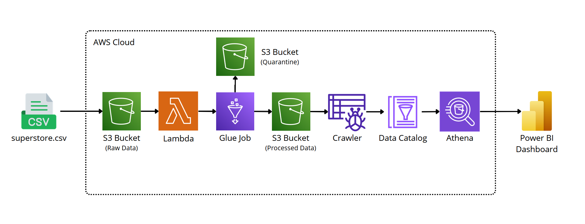
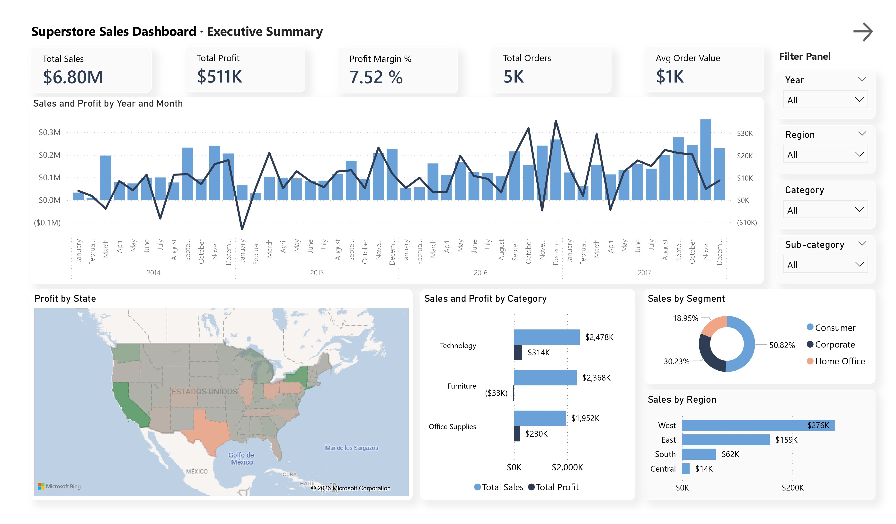
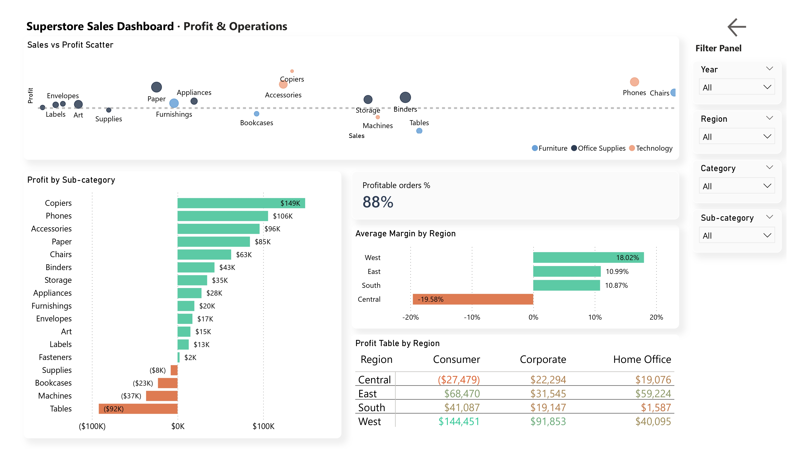

# Superstore ETL Pipeline · AWS + Power BI

**Language / Idioma:** [Español](#español) · [English](#english)

---

<a id="español"></a>
## Español

Pipeline de datos end-to-end sobre el dataset **Superstore** (retail: ventas, rentabilidad, envíos), construido con servicios serverless de AWS y visualizado en Power BI.

Ingesta → transformación (Spark/Glue) → catalogación → consulta (Athena) → visualización (Power BI), con checks de calidad de datos incluidos en el propio job.



### Tabla de contenidos

- [Objetivo](#objetivo)
- [Arquitectura](#arquitectura)
- [Stack](#stack)
- [Estructura del repositorio](#estructura-del-repositorio)
- [Pipeline paso a paso](#pipeline-paso-a-paso)
- [Transformaciones aplicadas](#transformaciones-aplicadas)
- [Calidad de datos](#calidad-de-datos)
- [Dashboards](#dashboards)

---

### Objetivo

Tomar el dataset público de Superstore (9,994 registros de ventas retail: pedidos, clientes, productos, envíos, descuentos y rentabilidad) y construir un pipeline reproducible que:

1. Limpia y enriquece los datos crudos
2. Los deja disponibles para consulta SQL sin necesidad de infraestructura de bases de datos administrada
3. Alimenta dashboards ejecutivos que respondan preguntas de negocio como: *¿qué regiones son más rentables?*, *¿qué categorías pierden dinero con los descuentos actuales?*, *¿cómo varían las ventas a lo largo del año?*

### Arquitectura

| Etapa | Servicio | Función |
|---|---|---|
| Ingesta | Amazon S3 (`raw/`) | Almacena el CSV original sin modificar |
| Automatización | AWS Lambda | Activa Glue cada vez que se suben archivos CSV a `raw/` |
| Transformación | AWS Glue (Spark) | Limpieza, tipado, columnas derivadas, checks de calidad |
| Almacenamiento curado | Amazon S3 (`processed/`) | Parquet + Snappy, particionado por `order_year`/`region` — solo filas que pasan calidad de datos |
| Cuarentena | Amazon S3 (`quarantine/`) | Parquet + Snappy, particionado igual — filas que fallan alguna regla de calidad |
| Catalogación | AWS Glue Crawler | Infiere el esquema y registra la tabla en el Data Catalog |
| Consulta | Amazon Athena | SQL serverless sobre el Parquet catalogado |
| Visualización | Power BI | Dashboards conectados directamente a Athena |

### Stack

- **Almacenamiento:** Amazon S3
- **Automatización:** AWS Lambda
- **Procesamiento:** AWS Glue (PySpark)
- **Catálogo de datos:** AWS Glue Data Catalog + Crawler
- **Consulta:** Amazon Athena
- **Calidad de datos:** AWS Glue Data Quality (DQDL)
- **Visualización:** Power BI (conector ODBC/Athena)

### Estructura del repositorio

```
superstore-etl/
├── README.md
├── architecture-diagram.svg
├── scripts/
│   └── superstore-etl.py        # Glue Job (extraer, transformar, calidad, cargar)
├── screenshots/
│   ├── dashboard-resumen-ejecutivo.png
│   └── dashboard-rentabilidad-operaciones.png
└── data/
    └── superstore.csv           # Dataset origen
```

> Nota: `processed/` y `quarantine/` son carpetas dentro del bucket S3 (no del repositorio) — se generan automáticamente al correr el Glue Job.

### Pipeline paso a paso

1. **Ingesta:** `superstore.csv` se sube a `s3://od-superstore-etl/raw/`, lo que dispara una función Lambda que inicia el Glue Job automáticamente
2. **Transformación (Glue Job):**
   - Lectura con `spark.read.csv`, especificando encoding `ISO-8859-1` (el CSV original no viene en UTF-8) y manejo explícito de comillas escapadas (`quote`/`escape`) para campos con medidas en pulgadas (ej. `72"H x 36"W`)
   - Limpieza, tipado y enriquecimiento (ver [Transformaciones aplicadas](#transformaciones-aplicadas))
   - Deduplicación por `row_id`
   - Evaluación de calidad de datos **a nivel de fila** (ver [Calidad de datos](#calidad-de-datos)): cada registro se marca como `Passed` o `Failed`
   - Las filas que pasan se escriben en `s3://od-superstore-etl/processed/`; las que fallan van a `s3://od-superstore-etl/quarantine/` — ambas como Parquet comprimido con Snappy, particionado por `order_year` y `region`
3. **Catalogación:** un Glue Crawler lee `processed/` y registra la tabla `processed` en la base de datos `superstore-etl` del Glue Data Catalog
4. **Consulta:** Amazon Athena consulta esa tabla; los resultados de las queries se guardan en `s3://athena-output/`
5. **Visualización:** Power BI se conecta a Athena vía el conector ODBC y alimenta dos dashboards

### Transformaciones aplicadas

**Limpieza y tipado**
- Normalización de nombres de columnas a `snake_case`
- Conversión de `order_date`/`ship_date` a tipo fecha
- Tipado numérico de `sales`, `quantity`, `discount`, `profit`
- Relleno de `postal_code` nulos con valor "00000"

**Columnas derivadas**

| Columna | Descripción |
|---|---|
| `shipping_days` | Días entre orden y envío |
| `order_year` / `order_month` / `order_quarter` | Descomposición temporal de `order_date` |
| `profit_margin` | `profit / sales` |
| `is_profitable` | Booleano, `profit > 0` |
| `shipping_speed` | `fast` / `normal` / `slow` según `shipping_days` |
| `is_high_season` | Booleano, `true` si el pedido es de Q4 |

**Deduplicación**
- Deduplicación por `row_id`, antes de la evaluación de calidad de datos

### Calidad de datos

El job usa **AWS Glue Data Quality** con evaluación **a nivel de fila** (`rowLevelOutcomes`), no solo a nivel de dataset. Esto significa que cada registro individual queda marcado como `Passed` o `Failed` según el ruleset, y el pipeline separa automáticamente los datos en dos destinos:

- **`s3://od-superstore-etl/processed/`** → filas que pasan todas las reglas (van al Data Catalog / Athena / Power BI)
- **`s3://od-superstore-etl/quarantine/`** → filas que fallan alguna regla (quedan disponibles para auditoría, no llegan al análisis)

**Ruleset (DQDL):**

```
Rules = [
    ColumnCount > 0,
    IsComplete "order_id",
    IsComplete "sales",
    IsUnique "row_id",
    ColumnValues "discount" between 0.0 and 1.0,
    ColumnValues "shipping_days" >= 0,
    CustomSql "select count(*) from primary where profit >= sales" = 0
]
```

Además de chequear el cumplimiento de estas reglas, `enableDataQualityCloudWatchMetrics: True` publica métricas de calidad en Amazon CloudWatch, haciendo que la tasa de filas rechazadas se puede graficar/alertar en el tiempo.

### Dashboards

**Resumen Ejecutivo**
KPIs generales (ventas, profit, margen, órdenes), tendencia mensual de ventas y profit, ventas por región (mapa), profit por categoría y distribución de ventas por segmento.



**Rentabilidad y Operaciones**
Scatter de ventas vs. profit por sub-categoría, profit detallado por sub-categoría, margen promedio por región y tabla de profit por región × segmento con formato condicional.



**Hallazgos destacados:**
- La región **Central** es la única con margen de profit negativo
- La sub-categoría **Tables** genera pérdidas de forma consistente en casi todas las regiones
- El 88% de los pedidos son rentables a nivel global

---

<a id="english"></a>
## English

End-to-end data pipeline built on the **Superstore** dataset (retail: sales, profitability, shipping), built with serverless AWS services and visualized in Power BI.

Ingestion → transformation (Spark/Glue) → cataloging → querying (Athena) → visualization (Power BI), with data quality checks built into the job itself.


### Table of contents

- [Goal](#goal)
- [Architecture](#architecture)
- [Stack](#stack-1)
- [Repository structure](#repository-structure)
- [Pipeline step by step](#pipeline-step-by-step)
- [Applied transformations](#applied-transformations)
- [Data quality](#data-quality)
- [Dashboards](#dashboards-1)

---

### Goal

Take the public Superstore dataset (9,994 retail sales records: orders, customers, products, shipping, discounts, and profitability) and build a reproducible pipeline that:

1. Cleans and enriches the raw data
2. Makes it available for SQL querying without needing managed database infrastructure
3. Powers executive dashboards that answer business questions like: *which regions are most profitable?*, *which categories lose money under current discount policy?*, *how do sales vary throughout the year?*

### Architecture

| Stage | Service | Function |
|---|---|---|
| Ingestion | Amazon S3 (`raw/`) | Stores the original CSV unmodified |
| Automation | AWS Lambda | Triggers Glue whenever CSV files are uploaded to `raw/` |
| Transformation | AWS Glue (Spark) | Cleaning, typing, derived columns, quality checks |
| Curated storage | Amazon S3 (`processed/`) | Parquet + Snappy, partitioned by `order_year`/`region` — only rows that pass data quality |
| Quarantine | Amazon S3 (`quarantine/`) | Parquet + Snappy, same partitioning — rows that fail any quality rule |
| Cataloging | AWS Glue Crawler | Infers the schema and registers the table in the Data Catalog |
| Querying | Amazon Athena | Serverless SQL over the cataloged Parquet data |
| Visualization | Power BI | Dashboards connected directly to Athena |

### Stack

- **Storage:** Amazon S3
- **Automation:** AWS Lambda
- **Processing:** AWS Glue (PySpark)
- **Data catalog:** AWS Glue Data Catalog + Crawler
- **Querying:** Amazon Athena
- **Data quality:** AWS Glue Data Quality (DQDL)
- **Visualization:** Power BI (ODBC/Athena connector)

### Repository structure

```
superstore-etl/
├── README.md
├── architecture-diagram.svg
├── scripts/
│   └── superstore-etl.py        # Glue Job (extract, transform, quality, load)
├── screenshots/
│   ├── dashboard-resumen-ejecutivo.png
│   └── dashboard-rentabilidad-operaciones.png
└── data/
    └── superstore.csv           # Source dataset
```

> Note: `processed/` and `quarantine/` are folders inside the S3 bucket (not the repository) — they're generated automatically when the Glue Job runs.

### Pipeline step by step

1. **Ingestion:** `superstore.csv` is uploaded to `s3://od-superstore-etl/raw/`, which triggers a Lambda function that starts the Glue Job automatically
2. **Transformation (Glue Job):**
   - Read with `spark.read.csv`, explicitly setting `ISO-8859-1` encoding (the original CSV isn't UTF-8) and handling escaped quotes (`quote`/`escape`) for fields with inch measurements (e.g. `72"H x 36"W`)
   - Cleaning, typing, and enrichment (see [Applied transformations](#applied-transformations))
   - Deduplication by `row_id`
   - **Row-level** data quality evaluation (see [Data quality](#data-quality)): each record is flagged as `Passed` or `Failed`
   - Passing rows are written to `s3://od-superstore-etl/processed/`; failing rows go to `s3://od-superstore-etl/quarantine/` — both as Snappy-compressed Parquet, partitioned by `order_year` and `region`
3. **Cataloging:** a Glue Crawler reads `processed/` and registers the `processed` table in the `superstore-etl` database of the Glue Data Catalog
4. **Querying:** Amazon Athena queries that table; query results are stored in `s3://athena-output/`
5. **Visualization:** Power BI connects to Athena via the ODBC connector and powers two dashboards

### Applied transformations

**Cleaning and typing**
- Column names normalized to `snake_case`
- `order_date`/`ship_date` converted to date type
- Numeric typing for `sales`, `quantity`, `discount`, `profit`
- Null `postal_code` filled with "00000"

**Derived columns**

| Column | Description |
|---|---|
| `shipping_days` | Days between order and shipment |
| `order_year` / `order_month` / `order_quarter` | Time breakdown of `order_date` |
| `profit_margin` | `profit / sales` |
| `is_profitable` | Boolean, `profit > 0` |
| `shipping_speed` | `fast` / `normal` / `slow` based on `shipping_days` |
| `is_high_season` | Boolean, `true` if the order is in Q4 |

**Deduplication**
- Deduplication by `row_id`, before the data quality evaluation

### Data quality

The job uses **AWS Glue Data Quality** with **row-level** evaluation (`rowLevelOutcomes`), not just dataset-level. This means each individual record is flagged `Passed` or `Failed` against the ruleset, and the pipeline automatically routes data into two destinations:

- **`s3://od-superstore-etl/processed/`** → rows that pass every rule (flow to the Data Catalog / Athena / Power BI)
- **`s3://od-superstore-etl/quarantine/`** → rows that fail any rule (kept for auditing, excluded from analysis)

**Ruleset (DQDL):**

```
Rules = [
    ColumnCount > 0,
    IsComplete "order_id",
    IsComplete "sales",
    IsUnique "row_id",
    ColumnValues "discount" between 0.0 and 1.0,
    ColumnValues "shipping_days" >= 0,
    CustomSql "select count(*) from primary where profit >= sales" = 0
]
```

Beyond checking compliance with these rules, `enableDataQualityCloudWatchMetrics: True` publishes quality metrics to Amazon CloudWatch, so the rejection rate can be charted/alerted on over time.

### Dashboards

**Executive Summary**
Overall KPIs (sales, profit, margin, orders), monthly sales and profit trend, sales by region (map), profit by category, and sales distribution by segment.


**Profitability & Operations**
Sales vs. profit scatter by sub-category, detailed profit by sub-category, average margin by region, and a profit table by region × segment with conditional formatting.


**Key findings:**
- The **Central** region is the only one with a negative profit margin
- The **Tables** sub-category consistently loses money across almost every region
- 88% of orders are profitable overall

---

## Autor / Author

Oscar Díaz G. · [GitHub](https://github.com/oscarsdg99) · [LinkedIn](https://www.linkedin.com/in/oscar-d%C3%ADaz-gonz%C3%A1lez-8987b0227/)
